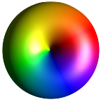
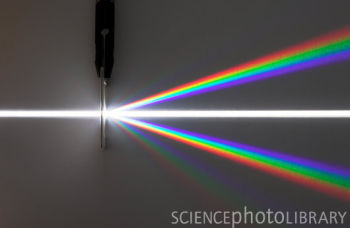

<!--
title: My Squishy Electron project
description: Getting Started
-->
## Squishy Electron project

This is a project I've been working on for a few years, off and on in my free time.
It's a work in progress, and this is the Alpha version here.

<a href='mailto:bojnac@tactileint.org"  >
Send Feedback Here sorry messed up!!!  😡 🥺 😢 😒
</a>
<mailBack>
</mailBack>

?subject="Squishy Electron Feedback'

'''Quantum Mechanics''' is an alternate set of rules for very tiny things,
like the size of atoms and molecules.
Squishy Electron is a simulator that lets you see how it works, without getting into a lot of math.
(Well, sortof.)

One of the creepiest things about Quantum is that objects can be in multiple places at once.
And, they can travel at multiple speeds, all at once.
It's like the particle is split into lots of little pieces, and spread out.

When I was a physics major, I had trouble getting a 'feel' for quantum mechanics.
I could do the math, I could visualize what was happening, but I kept on having a problem because things seemed so unintuitive.
This is pretty common among humans, even physicists;
it just doesn't work the way the real world works, that we can see with our own eyes.

Then, one day, I realized, I'd been asking the wrong question.
Don't ask, why are microscopic particles so unintuitive?
Ask instead, why is it that **humans have trouble understanding** microscopic particles?

Like any other child, **I didn't have any quantum toys**.
I had toys made of metal, plastic, fabric, wood.
That's because I grew up with solid objects, with definite surfaces, like anybody else.
Wood and metal and plastic all have surfaces; they have different textures,
but their surface layers all seem infinitesimally thin, and mostly inflexible.
Things made of fabric did hae fuzy surfaces, sometimes, but the amount of fuzz rarely changed.

I'd finger them, follow the surfaces and edges with my fingers or toes,
and put them in my mouth and feel them with my lips and tongue.
(I'm talking about, like, before kindergarten,
when fundamentals of the world crystalize in one's mind.)

The thing that we think of as a **particle** is really a **wave** in space.
The wave is actually a superposition (mix) of lots of locations, and lots of speeds, all at once.
The magnitude (size) of the wave, at some place,
is the probability that the particle is at that location.
The phase of the wave (peaks, troughs, or in-between) tell the motion of the particle.
This is why microscopic mechanisms are so weird - they follow quantum mechanical rules of waves.
We use rainbow colors to represent the phase of the wave.

The closest thing to a particle is a **wave packet**.
Here's one.
(Squishy Electron shows it upside down, but there's a reason behind it.)
Click the arrow to see the brief video.
<video src=wideGaussian.mp4 controls ></video>

As you can see, the packet spreads out as it travels.
This illustrates [Heisenberg's uncertainty principle](https://en.wikipedia.org/wiki/Uncertainty_principle):

$$\sigma_x \sigma_p ≥ ½ ℏ$$

That is, the fuzz (uncertainty) of the location, $\sigma_x$ , has an inverse relationship
with the uncertainty of the momentum, $\sigma_p$ , and therefore, speed.
If one is big, the other has to be small, and vice versa.
	<ul>
	<li>The uncertainty of the position is the width of the hump (wave packet);
	if we pretend that the electron is a tiny, tiny marble, all we know
	is that it is somewhere in that wave packet.
	<li>The height (thickness) of the wave tells you the probability of
	finding our tiny marble at that location.
	<li>The momentum of the wave is harder to see in this view; look at
	how quickly it proceeds through the rainbow, from left to right.
	<li>The total amount of wave is 1.000; that is, One electron.
	If it's more spread out, it's thinner.
	(We auto-range, so it might not look thinner.)
	</ul>

If you look up Paris with an online map, it might give you just one point, somewhere in the middle of the city.
Actually, Paris is pretty large, many kilometers from west to east and north to south.
This is kindof similar.
You can cut out a square kilometer near that point, and that's Paris, but not all of Paris.
Unlike Paris, the wave packet fades away at the edges instead of stopping at the city limits.

ℏ is [Plank's constant](https://en.wikipedia.org/wiki/Planck_constant).
It's a really tiny number, $1.05×10^{-34} {{kg m^2} \over s}$, so in normal life,
it seems like zero, and you can have an object at an exact location, going an exact speed.
(Give or take a nanometer or so.)
So, in order for an electron to have a more specific location, with a
very narrow wave packet, it must also have a more uncertain speed -
it must be a superposition of many different speeds.
It instantly starts spreading out because different parts of the
electron are going at different speeds, including backwards.
(This is a wrap-around universe, so the leading edge of the wave starts interfering
with the trailing edge, leading to the ripples you see.)

You can see that the rainbow pattern advances to the right over time;
this is the [phase velocity](https://en.wikipedia.org/wiki/Phase_velocity).
The packet (hump) itself also moves to the right, more quickly.
This is called the [group velocity](https://en.wikipedia.org/wiki/Group_velocity).
The group velocity is more like the actual velocity of the particle.

You can also see
[this video](https://www.youtube.com/watch?v=pLMiYnP-pAA) starting at 10:41.

### specific location
If you try to nail down the location more, by using a more narrow packet, the velocity is more uncertain, so it spreads faster.

<video controls src=narrowGaussian.mp4></video>

### specific velocity
The other side of the coin is, if we have a very exact, specific velocity
(momentum), the location is everywhere.
This is such a wave.  It's unrealistic in practice, because it has an
infinite length.  In Squishy Electron, the universe wraps around and is
therefore, finite, so we can model it here.

<video controls src=typicalCircular.mp4></video>

<aside style='float: right;'>
####So, how does an atom work?

The electrons have the same basic properties,
but they're all attracted to the protons in the nucleus.
They have a fuzzy wave packet; but the packet is circling the nucleus endlessly.
This is called an **electron shell**.
In order to be stable, there has to be a whole number of cycles around
the circumference of the orbit; zero cycles for ground-state hydrogen,
1 cycle for the first orbit up,
2 cycles for the second orbit, and on up.
This is where the word **quantum** comes from;
the electron wavelength has to be quantized - a whole number of waves, with no fractions.
</aside>

### pushing
<video controls src=potentialDemo.mp4></video>

The horizontal cream-colored line in this video represents the **Voltage**, effectively the  **Potential Energy**,
which describes the forces on the electron.
It's like a cross section of the earth, with hills and valleys, and
naturally, the electron will tend to **roll downhill** (actually more
like oozing).
With Squishy Electron, you can alter the potential by clicking and
dragging the cream-colored line.
So you can push around the electron with the mouse.

Notice how the phase changes to one solid color when the electron is not moving.

### bouncing
<video controls src=slamIntoWall.mp4></video>
On the left side of this video is a wall.
This electron is stuck in a **well**, a box where the sides have an infinite potential,
like being at the bottom of a smooth-walled cliff, that the electron can't pass over or through.
This video shows an electron slamming into the wall, and bouncing off.
Or, being **reflected** off of the wall, ending up with velocity going in the opposite direction.
But, different parts of the wave are reflected at different times,
so there's interference (jumbles) while it's going on.

### waves

Electrons aren't the only particles that travel as waves.
Protons and neutrons also do.
Of course, **photon particles - light - travel as waves**.
In this photo, different colors go in slightly different directions.
**The light only shows when all the peaks and troughs of the wave line up.**
And, the wavelength of each color is slightly different,
so they line up at slightly different places for different colors.

### Under the Hood
In Squishy Electron, the simulation runs real-time in a browser, with no contact with the server after loading.
Much of the code is JavaScript, running in the browser, just like any other website.
That part is done with React.

The numerical  integration, and most other time-critical numerical calculations, are done in C++,
in the browser, using Emscripten and WebAssembly.
It integrates a version of Schrodinger's equation.

The graphics are done in WebGL, a blindingly fast graphics rendering system,
using the computer's GPU chip(s).
(3D is on the wish list.)

### help allan find a job

[Allan's Portfolio](https://portfolio.tactileint.org)

[Allan's Resume](https://resume.tactileint.org)>
