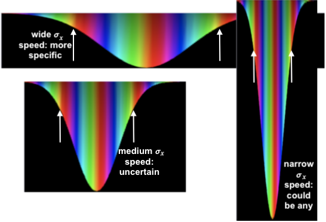

<!--
title: my Squishy Electron project
description: Overview and some results from Squishy Electron
-->

<!doctype html>
<html>
<head>
	<title>my Squishy Electron project</title>
	<meta charset="utf-8">
	<link rel="icon" href="logo|𝒆⟩3.png" type="image/png" sizes="any">
	

</head>
<body>
	<h2>Squishy Electron project</h2>

	<section>
		This is a project I've been working on since 2021.
		It's a work in progress, but I can show you some preliminary videos.

		

		When I was a physics major, I had trouble getting a 'feel' for quantum mechanics.
		I could do the math, I could visualize what was happening, but I kept on having a problem because things seemed so unintuitive.
		This is pretty common among humans, even physicists;
		it just doesn't work the way the real world works, that we can see with our own eyes.

		

		Then, one day, I realized, I'd been asking the wrong question.
		Don't ask, why are microscopic particles so unintuitive?
		Ask instead, why is it that <b>humans have trouble understanding</b> microscopic particles?

		

		Like any other child, <b>I didn't have any quantum toys</b>.
		I had toys made of metal, plastic, fabric, wood.
		That's because I grew up with solid objects, with definite surfaces, like anybody else.
		Wood and metal and plastic all have surfaces; they have different textures,
		but their surface layers all seem infinitesimally thin, and mostly inflexible.
		
		I'd finger them, follow the surfaces and edges with my fingers or toes,
		and put them in my mouth and feel them with my lips and tongue.
		(I'm talking about, like, before kindergarten,
		when fundamentals of the world crystalize in one's mind.)

		

		The thing that we think of as a <b>particle</b> is really a wave in space.
		The wave is actually a superposition of lots of locations, and lots of velocities, all at once.
		The magnitude of the wave is the probability that the particle is at that location.
		The phase of the wave (peaks, troughs, or in-between) tell the motion of the particle.
		This is why microscopic mechanisms are so weird - they follow quantum mechanics rules of waves.
		We use rainbow colors to represent the phase of the wave.
		 
	</section>

	<section>
		The closest thing to a particle is a <b>wave packet</b>.
		Here's one.
		(It looks upside down, but there's a reason behind it.)
		Click the arrow to see the brief video.

		

		<video controls >
			<source src=wideGaussian.webm>
			<source src=wideGaussian.mp4>
		</video>

		

		As you can see, the packet spreads out as it travels.
		This illustrates <a
		href=https://en.wikipedia.org/wiki/Uncertainty_principle>Heisenberg's
		uncertainty principle</a>:
		

		

		σ<var>x</var> σ<var>p</var> ≥  ½ ℏ
		

		
		

		That is, the uncertainty of the position, σ<var>x</var> , has an inverse relationship
		with the uncertainty of the momentum, σ<var>p</var> , and therefore, speed.
		If one is big, the other has to be small, and vice versa.
			<ul>
			<li>The uncertainty of the position is the width of the wave packet;
			if we pretend that the electron is a tiny, tiny marble, all we know
			is that it is somewhere in that wave packet.
			<li>The height (thickness) of the wave tells you the probability of
			finding our tiny marble at that location.
			<li>The momentum of the wave is harder to see in this view; look at
			how quickly it proceeds through the rainbow, from left to right.
			<li>The total amount of wave is 1.000; that is, One electron.
			If it's more spread out, it's thinner.
			(We auto-range, so it might not look thinner.)
			</ul>
		

		

		ℏ is <a href='https://en.wikipedia.org/wiki/Planck_constant'>Plank's reduced constant</a>.
		It's a really tiny number, 1.05×10-34 kg m²/s, so in normal life,
		it seems like zero and you can have an object at a specific location going a specific speed.
		(Give or take a nanometer or so.)
		So, in order for an electron to have a more specific location, with a
		very narrow wave packet, it must also have a more uncertain velocity (speed) -
		it must be a superposition of many different velocities.
		It instantly starts spreading out because different parts of the
		electron are going at different speeds, including backwards.
		(This is a wrap-around universe, so the leading edge of the wave starts interfering
		with the trailing edge, leading to the ripples you see.)
		

		

		You can see that the rainbow pattern advances to the right over time;
		this is the <a href=https://en.wikipedia.org/wiki/Phase_velocity>phase velocity</a>.
		The packet (hump) itself also moves to the right, more quickly.
		This is called the <a href=https://en.wikipedia.org/wiki/Group_velocity>group velocity</a>.
		The group velocity is more like the actual velocity of the particle.
		

	</section>

	<section>
		

		If you try to nail down the location more, by using a more narrow packet, the velocity is more uncertain, so it spreads faster.
		

		

		<video controls >
			<source src=narrowGaussian.webm>
			<source src=narrowGaussian.mp4>
		</video>
		

	</section>

	<section>
		

		The other side of the coin is, if we have a very exact, specific velocity
		(momentum), the location is everywhere.
		This is such a wave.  It's unrealistic in practice, because it has an
		infinite length.  In Squishy Electron, the universe wraps around and is
		therefore, finite, and we can model it here.
		

		

		<video controls >
			<source src=typicalCircular.webm>
			<source src=typicalCircular.mp4>
		</video>
		

		

		
		So, how does an atom work?
		The electrons have the same basic properties, but they're all attracted to the protons in the nucleus.
		They have a fuzzy wave packet; but the packet is circling the nucleus endlessly.
		This is called an <b>electron shell</b>.
		In order to be stable, there has to be a whole number of cycles around
		the circumference of the orbit; zero cycles for ground-state hydrogen or
		helium, 1 cycle for the second and third rows of the periodic table, and
		2 cycles for the fourth and fifth row.
		This is where the word <b>quantum</b> comes from;
		the wavelength has to be quantized - a whole number of waves, with no fractions.
		 

	</section>

	<section>
		<video controls style=float:left;padding-right:1em>
			<source src=potentialDemo.webm>
			<source src=potentialDemo.mp4>
		</video>

		The horizontal white line in this video represents the <b>Voltage</b>, effectively the  <b>Potential Energy</b>,
		which describes the forces on the electron.
		It's like a cross section of the earth, with hills and valleys, and
		naturally, the electron will tend to <b>roll downhill</b> (actually more
		like oozing).
		With Squishy Electron, you can alter the potential by clicking and
		dragging the white line.
		So you can push around the electron with the mouse.

		

		Notice how the phase changes to one solid color when the electron is not moving.
		 
	</section>

	<section>
		<video controls  style=float:left;padding-right:1em >
			<source src=slamIntoWall.webm>
			<source src=slamIntoWall.mp4>
		</video>

		<!--aside-->
		On the left side of this video is a wall.
		This electron is stuck in a <b>well</b>, a box where the sides have an infinite potential,
		like being at the bottom of a smooth-walled cliff, that the electron can't pass over or through.
		This video shows an electron slamming into the wall, and bouncing off.
		Or, being <b>reflected</b> off of the wall, ending up with velocity going in the opposite direction.
		But, different parts of the wave are reflected at different times,
		so there's interference (jumbles) while it's going on.
		<!--/aside -->
		 
	</section>

	<section>
		
		Electrons aren't the only particles that travel as waves.
		Protons and neutrons also do.
		Of course, <b>photon particles - light - travel as waves</b>.
		In this photo, different colors go in slightly different directions.
		<b>The light only shows when all the peaks and troughs of the wave line up.</b>
		And, the wavelength of each color is slightly different,
		so they line up at slightly different places for different colors.
		 
	</section>

	<h3 style=clear:left>Under the Hood</h3>
	The simulation runs real-time in a browser, with no contact with the server after loading.
	Much of the code is JavaScript, running in the browser, just like any other website.
	That part is done with React.

	

	The numerical  integration, and most other time-critical numerical calculations, are done in C++,
	in the browser, using Emscripten and WebAssembly.
	It integrates a version of Schrodinger's equation.

	

	This was far more difficult than I'd envisioned.
	It turns out that Schrodinger's is divergent - that is, if you just integrate it normally,
	it only runs for a short time before it explodes into high frequency noise.
	The equation amplifies high frequencies,
	so roundoff error in the double floats eventually overwhelms everything else.
	I found a better algorithm, and I'm using FFTs to deal with it,
	but it still diverges.
	Work continues.

	

	The graphics are done in WebGL, a blindingly fast graphics rendering system,
	using the computer's GPU chip(s).
	(3D is on the wish list.)

	<h2><a href=https://portfolio.tactileint.org>back to Allan's Portfolio</a>
	 <a href=https://resume.tactileint.org>back to Allan's Resume</a></h2>
</body>
</html>
