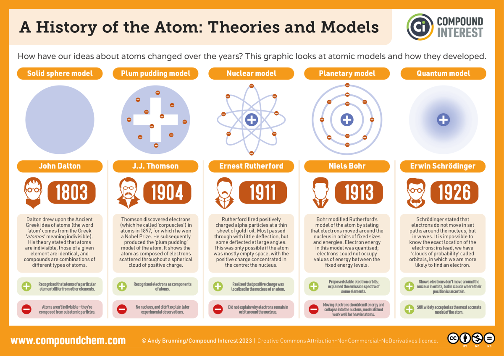

<!--
title: Quantum Mechanics
description: Explains what Quantum Mechanics is
-->

# Quantum Mechanics

Quantum Mechanics is what they call the physics of very small things.

It's actually a bad name for the concept.  The first branch of physics that anybody studied was just about things moving around, and also, things NOT moving around, and why.

## History

### Ancient Greeks
Ancient Greeks like
[Aristotle](https://en.wikipedia.org/wiki/Aristotle), the
[Pythagoreans](https://en.wikipedia.org/wiki/Pythagoras),
[Ctesibius](https://en.wikipedia.org/wiki/Ctesibius), and [Archimedes](https://en.wikipedia.org/wiki/Archimedes) argued over things like whether a vacuum could exist or not — a place with nothing in it.
There's a limit to what these early 'physicists' could do;
back then, things that were 'fast' were, like, a fast horse.
Flat surfaces were always lumpy, so they couldn't visualize any place that had no friction.
Things that flew through the air would go for a while, and drop, unless they were birds.
They thought that that was a physical law of nature.

[Leucippus](https://en.wikipedia.org/wiki/Leucippus)  and
[Kaṇāda](https://en.wikipedia.org/wiki/Kaṇāda)
were some of the first philosophers  to dream up the idea of an atom —
something that was 'uncuttable'.
You take a piece of cheese, cut it in half, and each piece is cheese.
You do it again, and again, each piece is cheese.
Do you get to the end — a piece that stops being cheese after being cut?
These were thought up centuries BCE.

### Middle Ages

During the middle ages, islamic thinkers like
[al-Biruni](https://en.wikipedia.org/wiki/al-Biruni) ,
[Ibn Bajja](https://en.wikipedia.org/wiki/Ibn Bajja) , and
[Abu'l-Barakāt](https://en.wikipedia.org/wiki/Abu'l-Barakāt)  started questioning Aristotle's writings, because some of his ideas were pretty primitive for the time.  Europe used it as scientific fact during the Dark Ages — if it wasn't written up in Aristotle, it was 'wrong'.  They also pondered coordinates, forces, motion and intertia.  During the Renaissance in Europe,
Huygens,
Leibniz, and, especially,
Galileo and
Newton began understanding gravity, friction and some of the actual laws of motion.

###  Modern Understandings
By the early 1800s, they knew about chemical elements and compounds,
from centuries of alchemy.
[John_Dalton](https://en.wikipedia.org/wiki/John_Dalton)
first figured out that elements combined in integer ratios.
For instance, cuprite, a red copper mineral, has one atom of coppper, and two atoms of oxygen.
But black copper, has one of each.
By experimentation, he figured out the ratios of atoms of all compounds were integers.

Electricity and Magnetism (they are related) was the next big area of physics.  Back then, electricity, magnetism and light were thought of as separate things.  In the middle ages, [al-Haytham](https://en.wikipedia.org/wiki/Ibn_al-Haytham),
[Shen Kuo](https://en.wikipedia.org/wiki/Shen Kuo) , and
[Cardano](https://en.wikipedia.org/wiki/Cardano)  worked on these topics.  During the Renaissance,
[Kepler](https://en.wikipedia.org/wiki/Kepler) ,
[Benjamin Franklin](https://en.wikipedia.org/wiki/Benjamin Franklin) ,
[Galvani](https://en.wikipedia.org/wiki/Galvani) , and
[Volta](https://en.wikipedia.org/wiki/Volta)  continued this work.  In the 1800s,
[Ørsted](https://en.wikipedia.org/wiki/Ørsted)  and
[Ampère](https://en.wikipedia.org/wiki/Ampère)  proved that electric currents produce a magnetic field.
[Faraday](https://en.wikipedia.org/wiki/Faraday)  proved that moving magnets produced an electrical current.  And
[Maxwell](https://en.wikipedia.org/wiki/Maxwell) 's Equations showed that electric and magnetic forces have a complementary, mirror-like relationship between them.  Maxwell showed that the equations could describe waves that traveled at the speed of light, thereby proving (kindof) that light was electromagnetic.

In all of that, mechanics was seen as fundamental bedrock, and electromagnetism was a layer above it.  So, when they learned about quantum, it was natural to call the bedrock of quantum Quantum Mechanics.  But, basic quantum is really more about simple existence, and the state that systems are in, which is so different from the rules everybody learns as a child.

### Quantum

Quantum came about from around 1900, when it turned out that light (now understood to be individual particles) would only be emitted by an atom in certain energy amounts (colors).  In fact, [Rydberg] figured out that each atom had a list of energy levels it could be in, and the photons would always have an amount of energy that was the difference between two of the levels.  These were not equally spaced, which made it harder to tease out what was really happening.  Instead, they were like 1, ¼, ¹⁄₉, ¹⁄₁₆, basically 1/n² where n is 0, 1, 2, ....  So you might have a photon come out that had an energy of ¹⁄₉ – ¹⁄₁₆, which is ⁷⁄₁₄₄.  Not very quantum-like.  But, other quantities were, like the angular momentum of an orbit, at ℏ, 2ℏ, 3ℏ, ....  And, ultimately, when they found ways for electrons to be created and destroyed, that even the number of electrons is a quantum number.  You cannot have 3½ electrons.  Things get more complicated after that.

### Atom Development

This goes over many developments:

# Quantum States

Quantum Mechanics, for me, was a sort of jumble of ideas at first.
Then, I started reading a book by Paul Dirac, one of the fathers of modern quantum mechanics.

I was a fan of General Relativity at the time.
It's the physics of gravity, above and beyond what Newton had developed.
The universe is measured with coordinates, in a big cartesian space.
Dirac's approach was totally different, and fairly abstract.

Quantum Mechanics is about states of a system.
But, it wasn't like in Relativity; there weren't many space coordinates.
It was more abstract.
And, a system could be in a superposition of different states.

### Angular Momentum 1

Momentum is something a moving object has.
A billiard ball rolling along a pool table has momentum.
If it hits another ball, that ball will be pushed in the same direction the original ball was  going.
That's momentum.
Momentum is conserved.
The new ball took some momentum from the first ball.
(There's lots of other details, you can look it up yourself.)

Angular momentum is similar, but it has to do with things moving in a circle.
They don't have to be moving in a circle, but typically they are.
If  two rocks, out in teh solar system somewhere, hit each other,
they never actually hit exactly head-on.
One is a little bit more this way,
the other is a little bit more that way.
If they stick together, the result is a spinning glob of rock.
Angular momentum is conserved;
each had angular momentum relative to the other.
Now, the resulting blob has all of that angular momentum.
(The details get into lots of details, you can go look it up yourself.)

On a microscopic scale, however, things start to get quantized.
Let's say you have a hydrogen atom; a simple system with one heavy proton in the middle,
and an electron buzzing around the outside.

# The End

Sorry, haven't had a chance to edit the rest of this, so it's kindof a mess.

🫣

A particle wave  only interferes with itself.  (that's my interpretation, what I was taught.)  For instance, if you take two lights, their light can't interfere with each other.  But, if you take one and run it through two slits, the same wave from the same single photon particle, can go through the two slits and interfere with itself on the other side, with that pattern.

By the Copenhagen interpretation, each particle coming off your piece of uranium (or whatever) in the cloud chamber starts out with a wave that's spherical (except it was probably emitted from one side, so it's really asymmetric - maybe different from your description, not sure).  That state is a superposition of eigenstates for each possible location and each possible momentum it can have.  They interfere so that all states of different locations or velocities cancel out, and only the spherical wave is present.

As soon as a line in the cloud chamber starts, whatever interaction caused that to happen (collision with an alcohol molecule?), changes the alpha particle's state and wave.  This is the collapse.  It is now a superposition of states that interferes so that only the state(s) representing that alpha particle at that location, moving in that velocity, are left.  All other states interfere with each other to vanish.

And, actually, each bubble in that line happens because of another interaction with the next alcohol molecule, cutting the Alpha momentum down a little bit, that's taken off by the alcohol molecule, which soon collides into nearby alcohol molecules, causing a sortof heat bubble, which shows up as part of that line.  (I think, not exactly sure how those bubble chambers work.)  The alpha particle continues off in the same line because it has enough momentum (MeV or keV) to blow away all the alcohol molecules in its way.

If that alpha particle, later, hits something else that's big, and scatters off into all directions, its state again changes, into one like the first above.

So all these states are superpositions of eigenstates.  You can choose your basis of eigenstates to be each possible combination of location and momentum, or each possible sphere traveling outward, or any other basis.  Just like, in 3d space, you can choose your basis of x y z coordinates to be East, South and Up, or South, West, Down, or any such combination, or any alternative rotated at any angle from those.  These vectors can all be described with 3 real numbers in a vector, and you can rotate or distort them linearly with a matrix, using matrix multiplication.  A vector like (5, 7, 9).

Quantum states, though, are ∞-dimensional vectors, with complex numbers in each slot.  Similar math, vastly different concept.  Each component represents the wave function component for an eigenstate you chose (you did choose one, right?).  Since there's an ∞ number of location eigenstates, even between two locations, we use complex-valued functions, like 𝜓(x) instead of matrices or vectors.  This is the wave function, and, at each point, you can find the probability of finding the alpha particle there, with 𝜓*⋅𝜓, you multiply 𝜓 with its complex conjugate, same as the absolute value squared.

🫣 🫣 🫣 🫣 🫣 🫣 🫣 🫣 🫣 🫣 🫣 🫣 🫣 🫣 🫣 🫣 🫣 🫣 🫣 🫣 🫣 🫣 🫣 🫣 angle polarizers

From https://www.researchgate.net/figure/a-The-waggle-dance-of-a-bee-The-angle-of-the-waggle-with-respect-to-the-vertical_fig2_316635407

cross-polarize demo:
https://www.youtube.com/watch?v=5SIxEiL8ujA
"Three polarizing filters: a simple demo of a creepy quantum effect"

https://dsimanek.vialattea.net/14/polaroid.htm yielded:
polcir.gif
polcls3.gif

🫣 🫣 🫣 🫣 🫣 🫣 🫣 🫣 🫣 🫣 🫣 🫣 🫣 🫣 🫣 🫣 🫣 🫣 🫣 🫣 🫣 🫣 🫣 🫣 🫣 🫣 🫣 🫣 🫣 🫣 🫣 🫣 🫣
